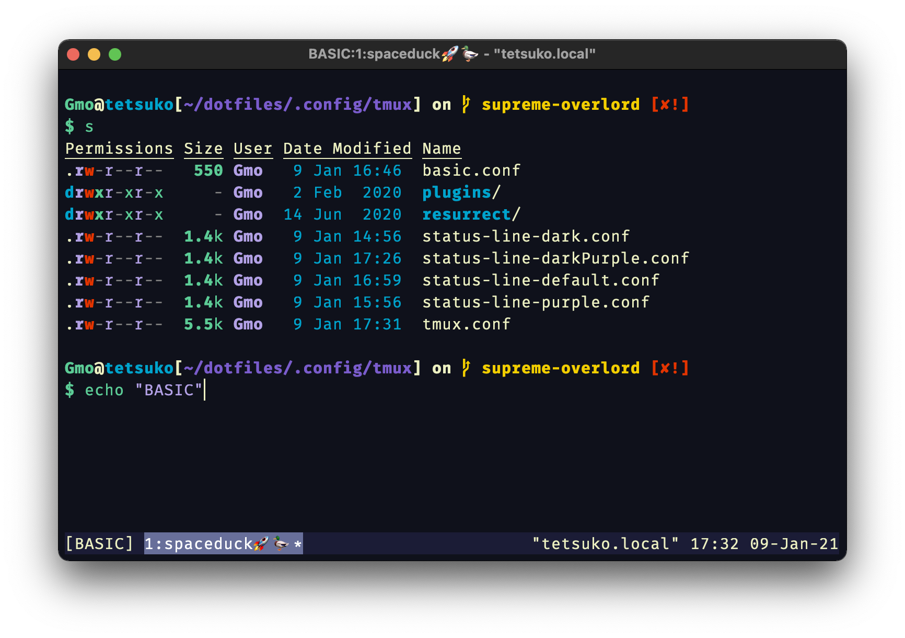
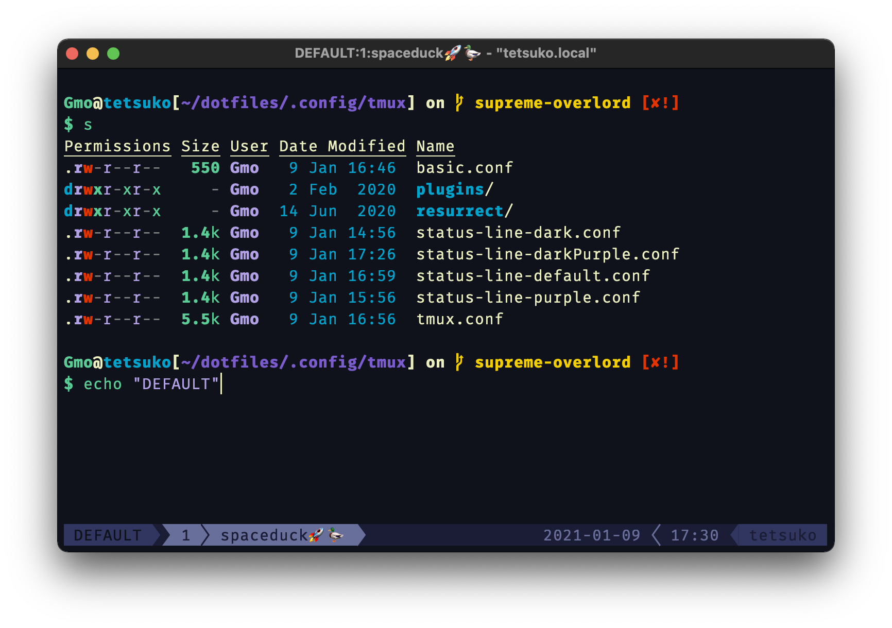
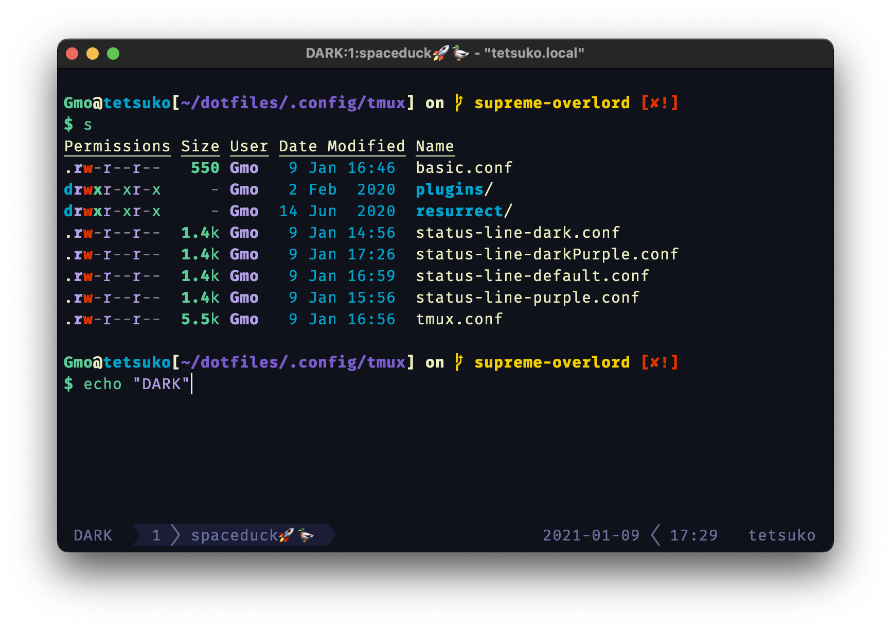
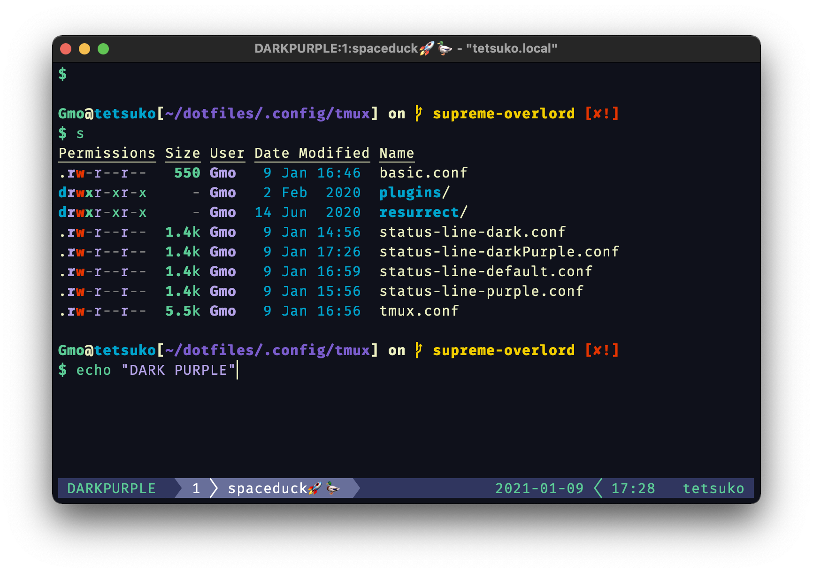
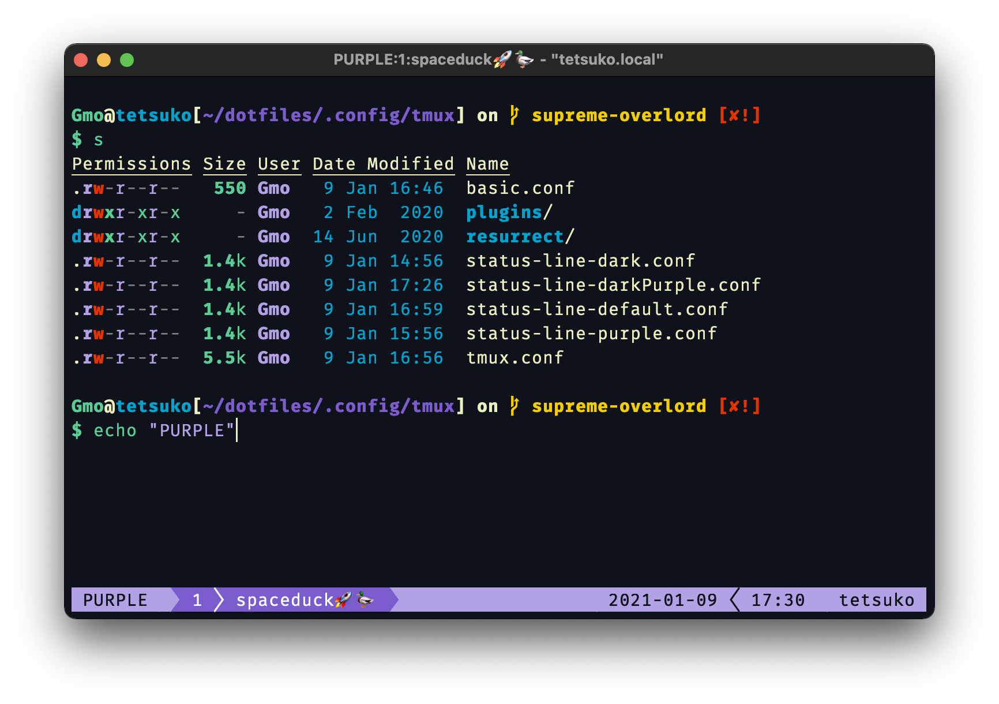

# Tmux configurations 💻

I couldn't decide what a good Tmux Spaceduck statusline would look like, so I customized a few options using this [tmux plugin](https://github.com/edkolev/tmuxline.vim).

If you're not using a [patched font](https://www.nerdfonts.com/) you can use the nice basic statusline that I have listed here.

## Basic tmux statusline



Put this bad boy in your [tmux.conf](https://wiki.archlinux.org/index.php/tmux#Configuration) or you can download the `basic.conf` and source it by using:

```tmux
  source-file basic.conf
```

```tmux
  # Basic color support setting
  set-option -g default-terminal "screen-256color"

  # Default bar color
  set-option -g status-style bg='#1b1c36',fg='#ecf0c1'

  # Active Pane
  set -g pane-active-border-style "fg=#5ccc96"

  # Inactive Pane
  set -g pane-border-style "fg=#686f9a"

  # Active window
  set-option -g window-status-current-style bg='#686f9a',fg='#ffffff'

  # Message
  set-option -g message-style bg='#686f9a',fg='#ecf0c1'
  set-option -g message-command-style bg='#686f9a',fg='#ecf0c1'

  # When Commands are run
  set -g message-style "fg=#0f111b,bg=#686f9a"
```

## Screenshots of the other configs

### Default



To use this statusline just download the file and source it with this command:

```tmux
  source-file status-line-default.conf
```

### Dark



To use this statusline just download the file and source it with this command:

```tmux
  source-file status-line-dark.conf
```

### Dark Purple



To use this statusline just download the file and source it with this command:

```tmux
  source-file status-line-darkPurple.conf
```

### Purple



To use this statusline just download the file and source it with this command:

```tmux
  source-file status-line-purple.conf
```
